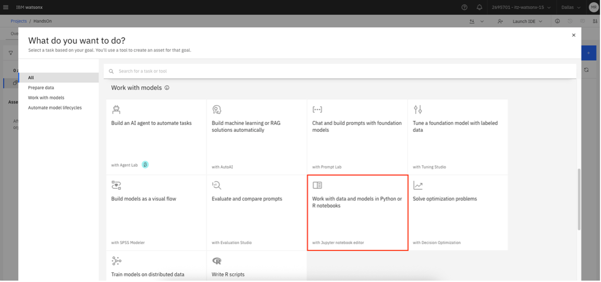
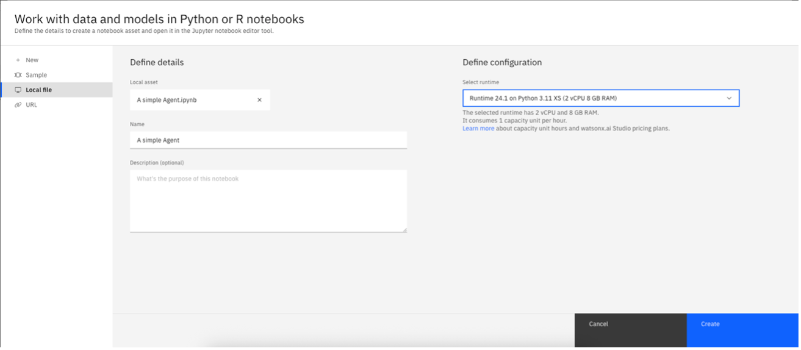
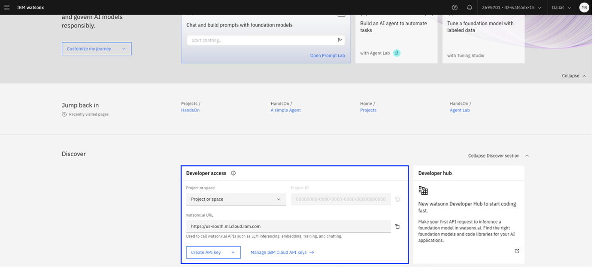
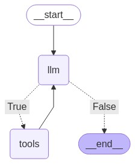

# Contents

* [Building a Simple AI Agent with IBM watsonx.ai](#building-a-simple-ai-agent-with-ibm-watsonxai)
* [Optional Lab](#optional-lab-adding-date-calculation-to-your-agent)

# Building a Simple AI Agent with IBM watsonx.ai
In this section, we will create a notebook asset to test agent development on watsonx.ai. We will build a simple AI agent that uses IBM watsonx.ai and NASA’s public API to interactively retrieve and display astronomy images, such as NASA’s "Astronomy Picture of the Day."

We assume you have already created a watsonx.ai project and associated it with a watsonx.ai runtime service. If you are starting from a clean environment, open the hamburger menu and navigate to **Projects** > **View all projects**. Create a new project (only the project name is required) and open it. Next, go to the **Manage** tab and, under **Services & integrations**, click **Associate service**. Select the appropriate watsonx.ai runtime and click **Associate**.

Within your project, navigate to the **Assets** tab and click **New asset**. Choose **Work with data and models in Python or R notebooks** to create a new Jupyter notebook.



The notebook file, *A simple Agent.ipynb*, is included in the asset ZIP folder, which can be downloaded from the homepage of this guide. You can run the notebook either on **watsonx.ai** (the approach followed in this guide) or locally on your machine if you have a python environment set up.

From the left-hand menu, select **Local file** and upload the notebook file named *A simple Agent.ipynb*. Keep the default runtime selected and click **Create**. The notebook should open automatically.



Wait for the runtime environment to start, then locate and edit the **Setup Credentials and Model Parameters** section. Here, enter your **url**, **api_key**, and **project_id**. If you do not have these values yet, you can retrieve or create them from the watsonx.ai homepage under the **Developer access** section.



Additionally, enter your NASA API key in the following section. If you do not have one, you can easily request it by filling out the form available on the [NASA API portal](https://api.nasa.gov/).

Click **Run** > **Run All Cells** to execute all the cells in the notebook.

Now that you have run the notebook, let’s walk through the steps taken to create this simple agent.

## Install libraries
In this first section we install libraries like *langchain*, *langchain_ibm*, *langgraph*, *nasapy* (NASA API wrapper), and some core LangChain tools.

```
pip install langchain
pip install langchain_ibm
pip install langchain_core
pip install langgraph
pip install nasapy
```

## Imports
We import functions for building agents, tools, memory, prompts, graphs, etc., mainly from *langchain*, *langgraph*, and *nasapy*.

```
from nasapy import Nasa
from langchain_ibm import ChatWatsonx
from langchain_core.tools import tool
from langchain_core.messages import AnyMessage, HumanMessage, ToolMessage
from langgraph.graph import StateGraph, END
from datetime import datetime, timedelta
from operator import add
from typing import Annotated
from typing_extensions import TypedDict
from IPython.display import Image, display
```

## Setup Credentials and Model Parameters
In this section, we configure the credentials required to use the LLM through the *ChatWatsonx* interface. To do so, replace WATSONX_URL, WATSONX_API_KEY, and PRJ_ID with the corresponding environment variables.

The model used in this example is *mistral-large*. We define model parameters like temperature (0, meaning deterministic), max/min token limits, etc.
The model used in this example is *mistral-large*, accessed via the ChatWatsonx interface. Mistral-large is a powerful open-weight large language model developed by Mistral AI. It is part of the Mistral series of transformer-based models known for their strong performance on reasoning, instruction following, and language generation tasks. While the exact number of parameters is not publicly disclosed, mistral-large is considered to be a high-capacity model optimized for both accuracy and efficiency.

In this setup, we configure a set of model parameters via the params dictionary to control the generation behavior:

- *decoding_method="greedy"*: This makes the model select the most probable next token at each step without randomness, resulting in deterministic outputs.

- *temperature=0*: This eliminates sampling variability, ensuring the same input always produces the same output — ideal for reproducibility and precision tasks.

- *min_new_tokens=5* and *max_new_tokens=250*: These set the lower and upper bounds on the number of tokens the model will generate in a response. This helps control verbosity and output length.

- *stop_sequences=['\n\n']*: This tells the model to stop generating text once it encounters a double newline, which is useful for delimiting responses clearly.

```
credentials = {
    "url": "WATSONX_URL",
    "apikey": "WATSONX_API_KEY",
    "project_id": "PRJ_ID"
}

params = {
    "decoding_method": "greedy",
    "temperature": 0, 
    "min_new_tokens": 5,
    "max_new_tokens": 250,
    "stop_sequences":['\n\n']
}

llm = ChatWatsonx(
  model_id =  "mistralai/mistral-large",
	url = credentials.get("url"),
	apikey = credentials.get("apikey"),
	project_id =  credentials.get("project_id"),
	params = params
)
```

## Setup NASA API key
The following code sets up access to the NASA API to retrieve images such as the Astronomy Picture of the Day. Replace NASA_API_KEY with the API key you generated earlier.

```
n = Nasa(key="NASA_API_KEY")
n.picture_of_the_day("2025-01-19")
```

## Define Tools for the Agent
In this section we create custom LangChain tools:
-	**get_todays_date() -> str**: returns today’s date as a string, formatted like "2025-04-28". If the user says something like: "Show me today's NASA picture", the agent needs to know the exact date for "today" to fetch the correct image.
-	**get_astronomy_image(date_of_picture: str) -> str**: accepts a specific date as input (format: "YYYY-MM-DD"). Calls the NASA API to fetch the Astronomy Picture for that specific date. Returns the image URL. When users ask: "Show me the NASA image from January 1st, 2020," the agent can look up images from the past.

```
@tool
def get_todays_date() -> str:
    """Get today's date in YYYY-MM-DD format.
    """
    date = datetime.now().strftime("%Y-%m-%d")
    return date

@tool(return_direct=True)
def get_astronomy_image(date_of_picture: str) -> str:
    """Get NASA's Astronomy Picture of the Day on given date.
    
    Args:
        date_of_picture: the date for the picture of the day.
    """
    apod = n.picture_of_the_day(date_of_picture, hd=True)
    return apod['url']

tools = [get_todays_date, get_astronomy_image]
tools_names = {t.name: t for t in tools}
llm_with_tools = llm.bind_tools(tools)
```

The tools are defined and exposed to the language model using the @tool decorator, and then bound to the LLM with llm.bind_tools(tools). 

By binding these tools to the LLM, the model becomes aware of:

- The **name** of each tool (e.g., *get_todays_date*, *get_astronomy_image*), which it uses to refer to and invoke the tool.

- What **inputs** each tool needs.

- The **purpose** and **usage** of each tool, derived from the function’s docstring. This helps the LLM understand when a tool might be relevant, such as using *get_todays_date* when asked about the current date, or calling *get_astronomy_image* when the user asks to see NASA’s picture of the day.

The *@tool(return_direct=True)* decorator on *get_astronomy_image* means the tool’s output will be returned directly to the user, bypassing additional LLM response formatting — ideal when the tool result (like a URL) is the final answer.

This tool binding process is fundamental to enabling agents to perform complex tasks by combining reasoning and action — reasoning to determine what is needed, and action to call the right tools at the right time.

## Define the LangGraph agent
The following code defines a tool-augmented agent using a stateful graph. It enables a LLM to interact with external tools by reasoning when a tool is needed, invoking the tool, and continuing the conversation based on the tool's output. The flow is managed using a StateGraph with two main nodes: one for calling the LLM and another for executing tools. 

The graph loops between the LLM and tool nodes until no further tool calls are needed.

<center></center>
<br>

```
class State(TypedDict):
  messages: Annotated[list[AnyMessage], add]

def execute_tools(state: State):
    tool_calls = state['messages'][-1].tool_calls
    results = []
    for t in tool_calls:
      if not t['name'] in tools_names:
        result = "Error: There's no such tool, please try again"
      else:
        result = tools_names[t['name']].invoke(t['args'])
        results.append(
          ToolMessage(
            tool_call_id=t['id'],
            name=t['name'],
            content=str(result)
          )
        )
    return {'messages': results}

def tool_exists(state: State):
    result = state['messages'][-1]
    return len(result.tool_calls) > 0
    
# func to add node
def run_llm(state: State):
    messages = state['messages']
    message = llm_with_tools.invoke(messages)
    return {'messages': [message]}

# create the agent graph
graph_builder=StateGraph(State)
graph_builder.add_node("llm", run_llm)
graph_builder.add_node("tools", execute_tools)
graph_builder.add_conditional_edges(
    "llm",
     tool_exists,
    {True: "tools", False: END}
    )

graph_builder.add_edge("tools", "llm")
graph_builder.set_entry_point("llm")

graph=graph_builder.compile()

# print the graph
display(Image(graph.get_graph().draw_mermaid_png()))
```

## Test Agent
Below are a few example prompts passed to the model and executed through the agent graph, along with the corresponding responses returned by the model.

1. What is today's date?

```
================================ Human Message =================================

What is today's date?
================================== Ai Message ==================================
Tool Calls:
  get_todays_date (rKy0k81ua)
 Call ID: rKy0k81ua
  Args:
================================= Tool Message =================================
Name: get_todays_date

2025-04-30
================================== Ai Message ==================================

 Today's date is 2025-04-30. Would you like to see NASA's Astronomy Picture of the Day for today?
```

2. What is NASA's Astronomy Picture of the Day for today?

```
================================ Human Message =================================

What is NASA's Astronomy Picture of the Day for today?
================================== Ai Message ==================================
Tool Calls:
  get_todays_date (4XgSPeQHQ)
 Call ID: 4XgSPeQHQ
  Args:
================================= Tool Message =================================
Name: get_todays_date

2025-04-30
================================== Ai Message ==================================
Tool Calls:
  get_astronomy_image (sASsobmX3)
 Call ID: sASsobmX3
  Args:
    date_of_picture: 2025-04-30
================================= Tool Message =================================
Name: get_astronomy_image

https://apod.nasa.gov/apod/image/2504/HappySkyMexico_Korona_960.jpg
================================== Ai Message ==================================

 Here is the Astronomy Picture of the Day for today:


```

 3. Show me NASA's Astronomy Picture using the date from 2 days ago.

```
================================ Human Message =================================

Show me NASA's Astronomy Picture using the date from 2 days ago.
================================== Ai Message ==================================
Tool Calls:
  get_todays_date (QiB8pnQaH)
 Call ID: QiB8pnQaH
  Args:
================================= Tool Message =================================
Name: get_todays_date

2025-04-30
================================== Ai Message ==================================
Tool Calls:
  get_astronomy_image (ENbppIk6w)
 Call ID: ENbppIk6w
  Args:
    date_of_picture: 2025-04-28
================================= Tool Message =================================
Name: get_astronomy_image

https://apod.nasa.gov/apod/image/2504/Gum37Hoo_Bozon_960.jpg
================================== Ai Message ==================================

 Here is the NASA's Astronomy Picture of the Day from 2025-04-28:


```

In these examples, the language model does not internally "know" the current date or the actual image from NASA’s feed. Instead, it uses tools (*get_todays_date*, *get_astronomy_image*) to fetch and incorporate factual data. This highlights an essential point: LLMs excel at interpreting intent and orchestrating tool use, but they lack real-time knowledge or persistent memory unless connected to external sources.

These outputs underscore how LLM reasoning is tightly coupled to how tools are exposed and sequenced:
- The model doesn’t know in advance that get_astronomy_image requires a date, it infers that from the tool schema or prior interactions.
- Correct sequencing — get_todays_date followed by get_astronomy_image(date=...) — is critical, and the agent graph must support multi-step chaining.

Limitations of this approach:
- The LLM doesn't verify the image’s content—it just embeds the URL provided by the tool. This reflects the fundamental limitation that LLMs don’t validate outputs—they assume correctness of tool responses.
- The third example — "Show me NASA’s Astronomy Picture using the date from 2 days ago" — shows how the LLM deduced that two days before April 30 is April 28. This date subtraction isn’t performed via a tool but implicitly inferred by the model, likely based on its training data and pattern recognition.
However, this reasoning lacks robustness across edge cases, such as leap years, end-of-month transitions, or time zone adjustments, unless those computations are offloaded to a **date-calculation tool**.

# Optional Lab: Adding Date Calculation to Your Agent
To make your agent more robust and capable of handling relative date queries (e.g. "2 days ago"), try adding a date calculation tool like the one below. Once added, re-run the notebook and observe the results.

1. Import the necessary module

    Add the following to your import section:
    ```
    from datetime import timedelta
    ```

2. Define the tool

    Add this tool to your code:
    ```
    @tool
    def get_date_n_days_ago(days_ago: str) -> str:
        """Get the date N days ago in YYYY-MM-DD format.
        
        Args:
            days_ago: Number of days to go back.
        """
        date = (datetime.now() - timedelta(days=int(days_ago))).strftime("%Y-%m-%d")
        return date
    ```

After implementing the tool, integrate it into your agent's toolset and test queries that involve relative dates (e.g., "Show me NASA's Astronomy Picture from 3 days ago").


[back to navigation](./)