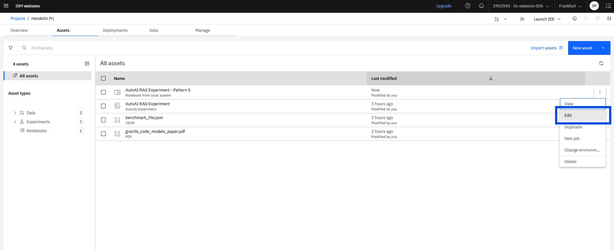

# Contents

* [AutoAI RAG](#autoai-rag)
  * [AutoAI RAG in the watsonx.ai UI](#autoai-rag-in-the-watsonx.ai-ui)
  * [Leverage the automatically generated notebook in order to quickly build a custom RAG service in watsonx.ai](#Leverage-the-automatically-generated-notebook-in-order-to-quickly-build-a-custom-RAG-service-in-watsonx.ai)

# AutoAI RAG

AutoAI RAG is a powerful feature of watsonx.ai that combines the
capabilities of AutoAI (Automated AI) with Retrieval-Augmented
Generation (RAG). This feature allows users to automatically build and
deploy AI models that retrieve relevant information from a vectorDB and
generate responses based on that information. It's particularly useful
for tasks like question-answering, chatbots, and other applications that
require context-aware responses.

AutoAI RAG is a versatile feature that can be used both through the
watsonx.ai UI and in a notebook environment, as we will see in this
section.

## AutoAI RAG in the watsonx.ai UI

First, we can leverage the low-code interface of watsonx.ai for building
up an AutoAI RAG experiment to test several RAG patterns involving
different LLMs, document chunk sizes, document overlapping windows etc.

From the the asset tab of the project, click on the “Create new asset”
button and select “Build machine learning or RAG solutions
automatically”, then select “Build a RAG solution”.


Define a name for your experiment on the newly opened tab and click
“Create”.


We now need to upload the corpus (a document or a collection of
document) that we will use as context for our RAG solution. For the
purpose of this lab, we will use the Granite Code model technical paper
that can be downloaded from <https://arxiv.org/pdf/2405.04324> . Once
downloaded, save it as "granite_code_models_paper.pdf" (consistency in naming the file is needed in order to correctly reference it in the benchmark file that we're going to create later) click “Browse” and
select the file saved in your local machine.


We now need to upload a JSON file containing the reference answers for
computing the quality of our RAG solution. In order to do so, create a
blank file and insert the following JSON snippet:

```
[
  {
    "question": "What are the two main variants of Granite Code models?",
    "correct_answer": "The two main variants are Granite Code Base and Granite Code Instruct.",
    "correct_answer_document_ids": ["granite_code_models_paper.pdf"]
  },
  {
    "question": "What is the purpose of Granite Code Instruct models?",
    "correct_answer": "Granite Code Instruct models are finetuned for instruction-following tasks using datasets like CommitPack, OASST, HelpSteer, and synthetic code instruction datasets, aiming to improve reasoning and instruction-following capabilities.",       
    "correct_answer_document_ids": ["granite_code_models_paper.pdf"]
  },
  {
    "question": "What is the licensing model for Granite Code models?",
    "correct_answer": "Granite Code models are released under the Apache 2.0 license, ensuring permissive and enterprise-friendly usage.", 
    "correct_answer_document_ids": ["granite_code_models_paper.pdf"]
  }
]
```

Save the file, return to the experiment
page, click “browse” and select the file to upload it.

The “configure details” tab provides the possibility to choose between
an in-memory vectorDB (chroma) and external connections to other
document stores (i.e. Milvus or Elastichsearch). For the scope of our
lab, select “In memory”; furthermore, we can select the JSON file to be
used as reference (it should be automatically detected since we have
uploaded only one JSON file).

Before moving forward, click on “experiment settings”.


From this screen, we can configure various aspects of our experiment
(which models to test, the document chunking sizes, the number of
patterns to be tested etc). Select “5” as the value of the “Max Rag
patterns” variable and click “Save”.


We are now ready to run our experiment: click “Run experiment” and wait
for the system to complete the process.

Once the experiment is completed, we are presented with a screen similar
to the one above, with a summary of the different steps executed and the
resulting RAG patterns that have been tested, also listed in a
leaderboard based on the evaluation metrics selected (in our case,
“answer correctness”, which measures the correctness of the generated
answer compared to the correct answer provided in the benchmark files,
including the relevance of the retrieved context and the quality of the
generated response).

<span class="mark">**OPTIONAL**:</span> explore the AutoAI Experiment
tabs in order assess which experiment’s settings have been the most
relevant in the evaluation of the different patterns and to compare the
different proposed patterns with respect to the different evaluation
metrics.

Once we have evaluated the different patterns, we can choose how to use
it for our purposes.

watsonx.ai provide two different approaches to use the results of our
experiments:

- directly deploy the selected pattern as an AI service in watsonx.ai in
  order to make it available “as is” to external users or applications;

- save it in a Jupiter notebook and use it as a starting point for
  further developments and refinements.

For the sake of our labs, we will follow the latter option and save the
selected RAG pattern as a Jupyter Notebook: hover your cursor over the
first pattern in the leaderboard and click on “Save as”.


Now select “Notebook” as asset type, click on “Select or create a space”
and select “Create a new deployment space”.

Note: The generated notebook will be saved in your current project and
does not directly need a deployment space. Anyhow, the generated
notebook serves primary as a code accelerator for helping developers in
implementing RAG services and thus provide also code blocks for
deploying these services and make them available externally.


In the newly opened tab, provide a name for your deployment space and
select the watsonx.ai runtime associated with your project (the runtime
should have been selected in the “Getting started” section of this lab
and thus be available in the drop-down menu) and click “Create”.


We can finally review our saving page and click “Create” to save our
experiment as a Jupyter Notebook.


Returing to the project page, we can indeed notice that our experiment
is now available as a notebook asset. In the next section we will
explore this notebook to leverage it in the building and deployment of a
RAG service in watsonx.ai.


**<span class="mark">OPTIONAL</span>**: Deploy the RAG Experiment as an
AI Service in the already created deployment space and test it running
an inference call against it.

## Leverage the automatically generated notebook in order to quickly build a custom RAG service in watsonx.ai

In this section, we will exploit the notebook automatically generated by the AutoAI service in order to speed up the creation of a custom, enterprise-grade RAG service to be deployed in watsonx.ai. Indeed, the generated notebook provides a pre-configured, production-ready RAG (Retrieval-Augmented Generation) pipeline that, by abstracting complex steps like document ingestion, vector database setup, and LLM integration, enables teams to focus on domain-specific customization rather than infrastructure. In particular, the notebook includes:

    - Built-in best practices and metadata derived from the AutoAI experiment (e.g. Optimized chunking, embedding models, retrieval logic, front-end LLM etc.)

    - Seamless IBM Cloud (or on-prem watsonx.ai services) integration, like direct connectivity to Watsonx.ai models, deployment spaces, and data assets.

    - One-click inference deployment to operationalize RAG as an API endpoint.

In order to understand how easily the automatically generated pipeline can be adapted to evolving needs and requirements, we will see how to change the embedding model of our pipeline.

First of all, we can go back to the project's asset page, click on the three dots on the right of the preaviously generated notebook and select "edit".



We are then presented with an editable and already runnable version of the notebook: review all the cells and provide your API key where needed.
As a first step, we could deploy the RAG pipeline produced by the AutoAI service as-is in the previoulsy created deployment space in watsonx.ai: select "Run" in the notebook's toolbar and click "Run all cells".


Review the output of the various cells and then go back to your deployment space and check that a new deployment service is now ready to be used.


Note that the service name is built up in the first cell of the "Retrieval & generation" section of the notebook based on what has been provided in the "rag_pattern" object in the "AutoAI experiment metadata" section.
Now we can move back to our notebook and customize the automatically built pipeline.
First of all, update the "rag_pattern" object in the "AutoAI experiment metadata" section so to have a new name for our custom RAG service.

```
rag_pattern["name"] = "Custom Pattern"
```
Run this cell and the following in order to have all the relevant objects updated in the runtime.
We can now start to play with parameters and configurations of the various building blocks of our pipeline. 
Just as an example, let's choose a different embedding model for our corpus. Watsonx.ai offers several embedding models to be used, both proprietary and open-source, and can be listed with a single command within our notebook (see the [documentation](https://dataplatform.cloud.ibm.com/docs/content/wsj/analyze-data/fm-models-embed.html?context=wx#embed) for details).

Create a new cell in the notebook and paste the following code:
```
wx_client.foundation_models.EmbeddingModels.show()
```
we are presented with a list of all the currently available embedding models.
Now we can update the embeddings model ID in the "AutoAI experiment metadata". 
Supposing that the original notebook used the "intfloat/multilingual-e5-large" model, we could for example consider to use an IBM proprietary model as the "ibm/granite-embedding-278m-multilingual" (or the other way around if that's the case):

```
rag_pattern["settings"]["embeddings"]["model_id"] = "ibm/granite-embedding-278m-multilingual"
```
Note that changing the embeddings model could affect our vector store, since different embedding models carry different requirement in terms of document dimensionality and maximum input tokens: assure to be consistent with model's requirements changing appropriately the "chunking_size" and "truncate_input_token" parameters af the "rag_pattern" object as well as the name of the Chroma vectore store index. 
In the case you want to use "ibm/granite-embedding-278m-multilingual", update the "rag_pattern" as follow and re-run all the cells of the "AutoAI experiment metadata" section:
```
rag_pattern["settings"]["chunking"]["chunk_size"] = 512
rag_pattern["settings"]["embeddings"]["truncate_input_tokens"] = 512
rag_pattern["settings"]["vector_store"]["index_name"] = "autoai_rag_custom"
```
Now we can re-run the "Create an embedding function", "Initialize the VectorStore", "Embed and index documents" and "Retrieval evaluation" sections to check that the new embeddings retrieve different passages than before.


Finally, we can re-run all the cells of the notebook and, once finished, we can check that a new version of our RAG pipeline has been made available for inference in our deployment space.


Note that selecting one of the deployed pipeline, we could easily test it using the "Preview" tab of the deployment:


**<span class="mark">OPTIONAL</span>**: Deeper explore the cells of the automatically generated notebook and test different configurations (e.g. different chunking size, retrieval strategies, prompt, vector distances etc).

[back to navigation](./)
