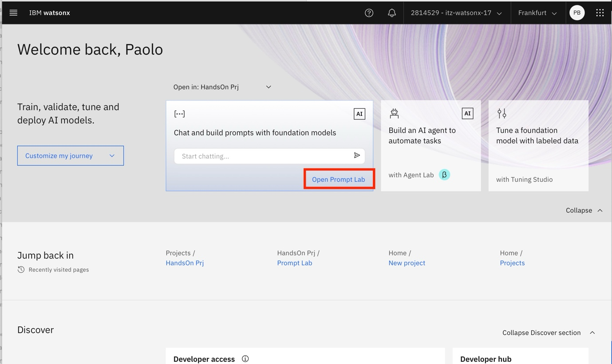
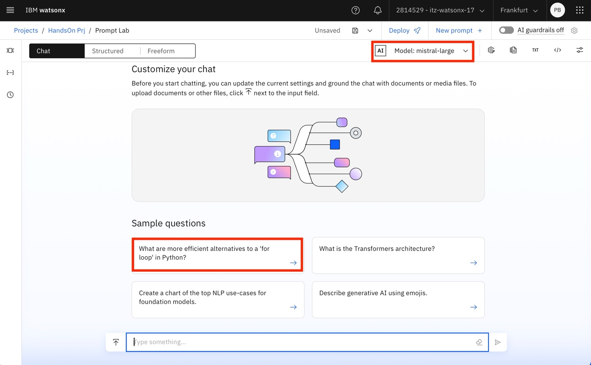
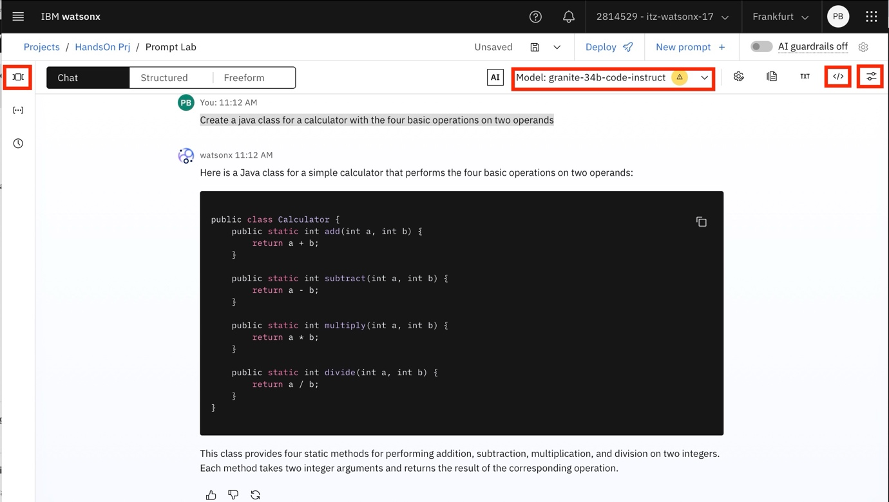
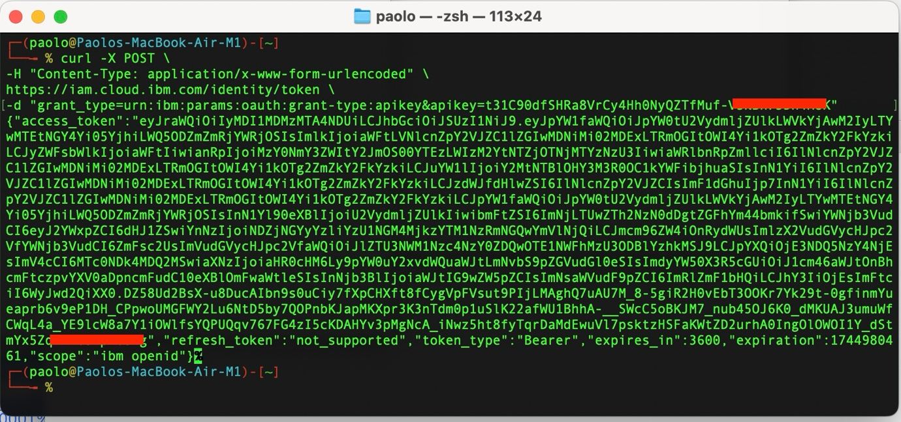
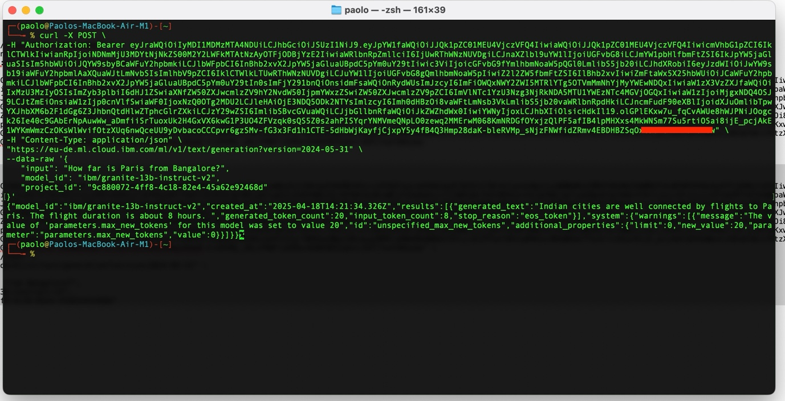

# Contents

* [First Steps](#first-steps)
  * [Prompt Lab](#prompt-lab)
  * [Use an API to call watsonx](#use-an-api-to-call-watsonx)

# First Steps

## Prompt Lab

One thing you can try right away is to access the PROMPT LAB and start
chatting with the model of choice.

Scroll back up and access the PROMPT LAB





You can now chat with the model, explore different prompts and run some
prompt tuning.

You could, in example, select the granite code model and input the
following prompt

```
Create a java class for a calculator with the four basic operations
```
<span class="mark">**OPTIONAL**:</span> Play around with the interface
and familiarize with the example prompts and the available models. Also
note that the interface gives you the possibility of showing the
equivalent API call to the action performed by the UI by clicking on the
&lt;/&gt; icon. Explore the sample prompts by opening the samples on the
left or test different model parameters by tweaking the values on the
right menu.



## Use an API to call watsonx

You should now have the following:

{API KEY}

{PROJECT ID}

{URL}

To access the environment from a client or from code you need to
**create and access token**. You authenticate to watsonx.ai by including
a bearer token in your requests. The token is generated from your {API
KEY}

Open a terminal window to issue the following CURL command

Replace {apikey} with the value of the API key that you created.

```
curl -X POST \</p>
-H "Content-Type: application/x-www-form-urlencoded" \</p>
https://iam.cloud.ibm.com/identity/token \</p>
-d "grant_type=urn:ibm:params:oauth:grant-type:apikey&amp;apikey={apikey}"</p></td>
```



You can now make your first API to infer text from text input. Replace
{token}, {watsonx\_ai\_url}, and {project\_id} with information from
your account.



There are several ways you can handle this call. Here’s a quick shell
script to handle the access token creation and the text generation call.

```bash
#!/bin/bash

# Set API key as an environment variable
export APIKEY="{API_KEY}"
# Set Project ID as an environment variable
export PRJ_ID="{PRJ_ID}"
# Set the question
INPUT_TEXT="How far is Paris from Bangalore?"

# Use curl to get the API response and store it in a variable
API_RESPONSE=$(curl -s -X POST \
  -H "Content-Type: application/x-www-form-urlencoded" \
  https://iam.cloud.ibm.com/identity/token \
  -d "grant_type=urn:ibm:params:oauth:grant-type:apikey&apikey=$APIKEY")

# Store access token in a variable from the JSON response
ACCESS_TOKEN=$(echo "$API_RESPONSE" | jq -r '.access_token')

# Print the question
echo "Q: "$INPUT_TEXT

# Make the API call to Watsonx and extract 'generated_text' from the response
API_RESPONSE=$(curl "https://eu-de.ml.cloud.ibm.com/ml/v1/text/generation?version=2023-05-29" \
  -H 'Content-Type: application/json' \
  -H 'Accept: application/json' \
  -H "Authorization: Bearer $ACCESS_TOKEN" \
  -s \
  -d '{
    "input": "<|start_of_role|>system<|end_of_role|>You are Granite, an AI language model developed by IBM in 2024. You are a cautious assistant. You carefully follow instructions. You are helpful and harmless and you follow ethical guidelines and promote positive behavior.<|end_of_text|><|start_of_role|>user<|end_of_role|>'"$INPUT_TEXT"'<|end_of_text|><|start_of_role|>assistant<|end_of_role|>",
    "parameters": {
      "decoding_method": "greedy",
      "max_new_tokens": 900,
      "min_new_tokens": 0,
      "stop_sequences": [],
      "repetition_penalty": 1
    },
    "model_id": "ibm/granite-3-8b-instruct",
    "project_id": "'$PRJ_ID'"
  }'
)

# Extract 'generated_text' from the JSON response using jq
GENERATED_TEXT=$(echo "$API_RESPONSE" | jq -r '.results[0].generated_text')

# Print the extracted text
echo "A: "$GENERATED_TEXT
```

**<span class="mark">OPTIONAL</span>**: Try implementing the same call
using the watsonx.ai Python SDK. For info on how to get started with the
SDK refer to the watsonx Developer Hub at
https://www.ibm.com/watsonx/developer/get-started/quick-start.

[back to navigation](./)