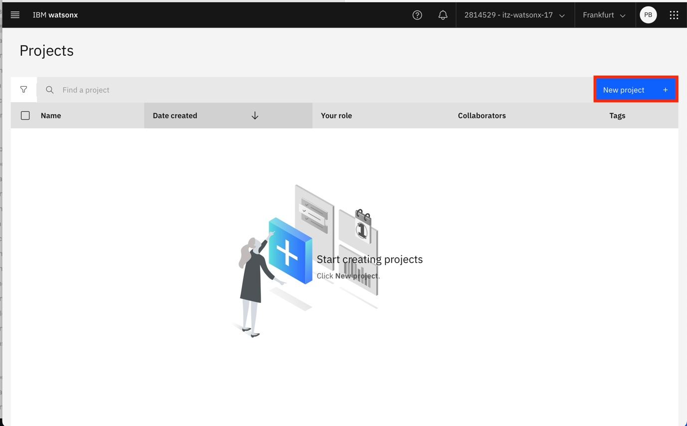
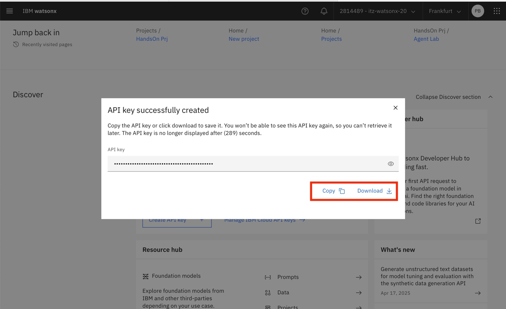

# Contents

* [Getting started](#getting-started)
  * [Provision the environment](#provision-the-environment)
  * [Create a project and retrieve the Project ID](#create-a-project-and-retrieve-the-project-id)

# Getting started

## Provision the environment

First, you need to reserve an environment on TechZone. We are going to
use a Certified Base Image. Access TechZone at
<https://techzone.ibm.com> and scroll down to

browse for the Base Image that we need.

Search for a watsonx related image named: “watsonx.ai/.governance SaaS”.

Click on the button to start the reservation process

**Fill out the form as indicated in the following pictures and wait for
the activation emails. Take note that you might be required to join a
particular IBM Cloud Account. Take also note of the IBM Cloud Region in
which you are activating the environment.**

Once the activation process is finished you will be able to see the
reservation in you My Reservations section on the TechZone portal. By
Clicking on the button you will be able to list login info and take note
of your API KEY.

Take note of the information provided by techzone. Click on the IBM
Cloud Login Link.

The IBM Cloud displays a list of resources available in the account.
Find the one for watsonx and follow the link.

Launch the watsonx.ai runtime in IBM watsonx.

You should be logged into your watsonx environment. Make sure that you
are on the correct IBM Cloud Account and Region.

## Create a project and retrieve the Project ID

Create a new
project

Associate a machine learning service

Once you created the project and associated the service, you can go back
to the home page in Watsonx and retrieve the PROJECT ID

Scroll down to the Developer access tile to find the PROJECT ID and
WATSONX.AI URL. Copy them on a local text file to use later.

You should also create an API Key and copy it to proceed with the
following steps.

[back to navigation](./)